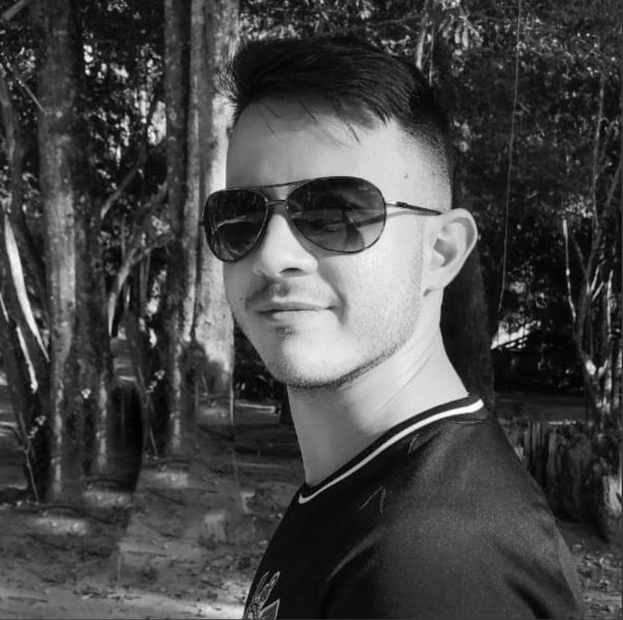

  

# Portfólio digital de Guilherme dos Santos Benedito
## Orientador: Fabrício Galende Marques de Carvalho

### Tecnologias utilizadas:
<ul>
    <li>Git</li>
    <li>GitHub</li>
    <li>HTML</li>
    <li>Css</li>
    <li>Python</li>
    <li>Flask</li>
    <li>Markdown</li>
</ul>

<h2>Execute a aplicação: </h2>
<h4>1. Certifique-se de possuir o python instalado, caso não possua, <a href="https://www.python.org/downloads/" target="_blank"> clique aqui. </a> </h4>
<h4>2. Crie uma pasta vazia</h4>
<h4>3. Abra o Terminal ou CMD no diretório da pasta vazia</h4>
<h4>4. Clone o repositório com o comando: </h4>
  
    git clone https://github.com/gui-benedito/portfolio_digital.git  

<h4>5. Acesse a pasta api com o comando: </h4>
  
      cd .\portfolio_digital\api\
  
<h4>6. Ative o ambiente virtual e suas dependências com os seguintes comandos: </h4>
  
      python -m venv venv
      .\venv\Scripts\activate
      pip install -r ..\requirements.txt
  
<h4>7. Execute a aplicação com o seguinte comando: </h4>
  
      flask run
  
<h4>8. Clique no link 'http://127.0.0.1:5000' segurando a tecla Ctrl, ou <a href="http://localhost:5000"> clique aqui. </a> </h4>
    
<h4>9. Para finalziar, aperte crtl + c no terminal, insira o comando abaixo para desligar o ambiente virtual. </h4>
  
      deactivate  
